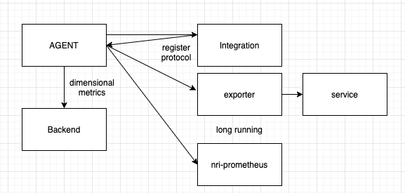

[](https://opensource.newrelic.com/oss-category/#community-plus)

# Prometheus Exporter Packages

This project aims to provide a better installation and configuration experience for Prometheus exporters of `nri-prometheus`.
It packages several open-source Prometheus exporters together with a binary that translates the input data into
the specific format needed by the exporters and the `nri-prometheus` integration triggering their execution.

All native packages are available for installation in New Relic's public repositories.

## Basic architecture of prometheus based integrations 

With respect to "standard" integrations the ones based on prometheus do not collect the data anymore from
the service, but they leverages the configuration protocol in order to register both `nri-prometheus` and an exporter
(if the service does not expose directly prometheus metrics).

This repository provides a way to create packages to install the exporters, and an additional binary used to configure 
and trigger the execution of both `nri-prometheus` and the installed exporters.



## Installation
Before installing any of the exporters, be sure to read the documentation for the specific exporter you want to install.
Each exporter may have specific configuration options that will require you to modify to make it work for your environment.

Also make sure you read the documentation about the [Infrastructure agent](https://github.com/newrelic/infrastructure-agent). 
The agent, in conjunction with our [Prometheus Open Metrics integration](https://github.com/newrelic/nri-prometheus), 
is the component responsible for sending the metrics, provided by the exporter, to New Relic.

- Ubuntu, Debian

```bash
sudo apt-get install <exporter package name>
```

- Amazon Linux, Amazon Linux 2, RHEL, CentOS

```bash
sudo yum install <exporter package name>
```

- SLES

```bash
sudo zypper install <exporter package name>
```

## Local Build and Test

There are Make targets that helps you build and run e2e test locally:

* Compile an integration:
```bash
make fetch-resources-<exporter_name>
make build-<exporter_name>
```

* Run End to End test:
```bash
make fetch-resources-<exporter_name>
make build-<exporter_name>
make test-e2e-<exporter_name> \
  ACCOUNT_ID=<NEWRELIC_ACCOUNT_ID> \
  API_KEY=<NEWRELIC_API_KEY> \
  LICENSE_KEY=<NEWRELIC_LICENSE_KEY>
```

Go `1.17+` is needed in order to run the e2e test without installing the `newrelic-integration-e2e`.

### nri-config-generator
`nri-config-generator` folder contains all the code needed to build a binary capable to get as input the classical 
user configuration and as output a register protocol sample that will trigger in the agent the execution of:
 - `nri-prometheus` with the needed configuration (port, ignore rules, targetURL, etc)
 - the exporter with the specific configuration needed. Note that this is not needed if the monitored technology is 
exporting prometheus metrics natively.

All the integrations share the same code since the different configurations are passed using the `//go:embed` directive.

In particular the configuration injected is the integration configuration stored under `./exporters/{exporterName}`

### How can I track down different versions?

Since there are a lot of moving pieces it can be difficult data to understand what is actually
running in the environment checking only newrelic.
Each metric will be decorated with the following common attributes:
 - "instrumentation.name": "nri-powerdns", (name of integration)
 - "instrumentation.version": "0.0.2", (version of integration)
 - "collector.name": "infrastructure-agent",  (binary sending data to the backend, in standalone nri-prometue it is nri-prometheus itself)
 - "collector.version": "1.19.2", (version of collector)

The version of nri-prometheus can be retrieved from the agent one since they are package together.
The version of the exporter can be retrieved from the integration version for the same reason

The data regarding the integrations are passed by configuration as metadata to nri-prometheus.

### Adding a new exporter

In order to add a new exporter create a new folder `./exporters/{exporterName}` with the needed files, you can refer to
the `powerdns` as an example.

In each folder we expect to find:
  - `exporter.yml`: definition of the exporter
  - `build.sh` a bash script that will generate the exporter binary under `exporters/{exportername}/target/bin/`
    Notice that this is needed if in the definition of the exporter package_linux=true
  - `win_build.ps1` a powershell script that will generate the windows exporter binary under `exporters/{exportername}/target/bin/`
    Notice that this is needed if in the definition of the exporter package_windows=true
  - `{exporterName}-config.yml.sample` containing the configuration sample for the Infrastructure Agent to run the exporter
  - `{exporterName}.json.tmpl` containing the integration configuration mappings loaded with the `//go:embed` directive.
  - `{exporterName}.prometheus.json.tmpl` (Optional) containing the nri-prometheus configuration mappings loaded with the `//go:embed` directive. If this file is not present, the default file `config.json.tmpl` located under `nri-config-generator/default template` will be used.

The definition file requires the following fields:
```yaml
# name of the exporter, should match with the folder name
name: powerdns
# version of the package created
version: 0.0.2
# Relative path to the License path from the repository root
exporter_license_path: LICENSE
# URL to the git project hosting the exporter
exporter_repo_url: https://github.com/lotusnoir/prometheus-powerdns_exporter
# Tag of the exporter to checkout
exporter_tag:
# Commit of the exporter to checkout (used if tag property is empty)
exporter_commit: fffbd7c4768681f93988c2c3287b690db20e6ce0
# Changelog to add to the new release
exporter_changelog: https://github.com/lotusnoir/prometheus-powerdns_exporter/tags
# Enable packages for Linux
package_linux: true
# Enable packages for Windows
package_windows: false
# Upgrade GUID used in the msi package. Required if package_windows is set to true
# This GUID should be generated and be unique across all exporters in the repository
upgrade_guid: 278db4a4-60a9-493b-b878-dc7b445a2db0
# Integration GUID used in the msi package. Required if package_windows is set to true
# This GUID should be generated and be unique across all exporters in the repository
nri_guid: 44ac2940-4aff-46fc-a46b-b1b8cd9a3505
# Exporter GUID used in the msi package. Required if package_windows is set to true
# This GUID should be generated and be unique across all exporters in the repository
exporter_guid: b246fde4-0083-4e16-beb0-09139fb5ca9f
# License GUID used in the msi package. Required if package_windows is set to true
# This GUID should be generated and be unique across all exporters in the repository
license_guid: a63afbd8-5ea3-4bac-85cc-1da438b8c8f4
# This GUID should be generated and be unique across all exporters in the repository
config_guid: 86733900-4e10-478c-9633-61595d0e7acb
```

When added open a PR and once merged to master a github action workflow will start building and uploading packages to Github. 

 - In case one exporter definition has been modified or added the exporter will be released for the os requested and a Github release will be created
 - In case more than one exporter definitions have been modified the pipeline fail.

Please notice that exporters have their own `build` script but they share the packaging scripts, located under `./scripts`

## Support

New Relic has open-sourced this project. This project is provided AS-IS WITHOUT WARRANTY OR DEDICATED SUPPORT. Issues and contributions should be reported to the project here on GitHub.

We encourage you to bring your experiences and questions to the Explorers Hub where our community members collaborate on solutions and new ideas.

**Support Channels**

* [New Relic Documentation](https://docs.newrelic.com): Comprehensive guidance for using our platform
* [New Relic Community](https://discuss.newrelic.com/t/prometheus-exporters-packages/116524): The best place to engage in troubleshooting questions
* [New Relic Developer](https://developer.newrelic.com/): Resources for building a custom observability applications
* [New Relic University](https://learn.newrelic.com/): A range of online training for New Relic users of every level
* [New Relic Technical Support](https://support.newrelic.com/) 24/7/365 ticketed support. Read more about our [Technical Support Offerings](https://docs.newrelic.com/docs/licenses/license-information/general-usage-licenses/support-plan).

## Privacy

At New Relic we take your privacy and the security of your information seriously, and are committed to protecting your information. We must emphasize the importance of not sharing personal data in public forums, and ask all users to scrub logs and diagnostic information for sensitive information, whether personal, proprietary, or otherwise.

We define “Personal Data” as any information relating to an identified or identifiable individual, including, for example, your name, phone number, post code or zip code, Device ID, IP address, and email address.

For more information, review [New Relic’s General Data Privacy Notice](https://newrelic.com/termsandconditions/privacy).

## Contribute

We encourage your contributions to improve this project! Keep in mind that when you submit your pull request, you'll need to sign the CLA via the click-through using CLA-Assistant. You only have to sign the CLA one time per project.

If you have any questions, or to execute our corporate CLA (which is required if your contribution is on behalf of a company), drop us an email at opensource@newrelic.com.

**A note about vulnerabilities**

As noted in our [security policy](../../security/policy), New Relic is committed to the privacy and security of our customers and their data. We believe that providing coordinated disclosure by security researchers and engaging with the security community are important means to achieve our security goals.

If you believe you have found a security vulnerability in this project or any of New Relic's products or websites, we welcome and greatly appreciate you reporting it to New Relic through [HackerOne](https://hackerone.com/newrelic).

If you would like to contribute to this project, review [these guidelines](./CONTRIBUTING.md).

To all contributors, we thank you!  Without your contribution, this project would not be what it is today.

## License
Prometheus Exporter Packages is licensed under the [Apache 2.0](http://apache.org/licenses/LICENSE-2.0.txt) License.
